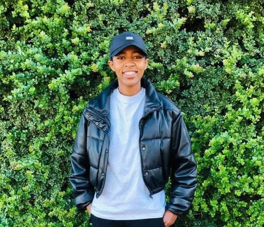

<h1 align="center"> My Digital Portfolio </h1>   

<h2 align="center"> Qhama Dyushu  </h2>  
---

  

  

---
<h2 align="center"> Introduction </h2> 

  
Welcome to my **Digital Portfolio**!  
I am **Qhama Dyushu**, a passionate **third-year Diploma in Information and Communication Technology** student.  
This portfolio was developed for the **Work Readiness Training Programme (PRP370-1-2S)** as part of my **Project Presentation 3** assessment.  

Through this journey, I’ve strengthened my ability to communicate professionally, prepare for interviews, network effectively, and practice strong workplace etiquette — essential skills for a successful ICT career.  

Each section follows the **STAR Technique (Situation, Task, Action, Result)** to reflect on how I’ve grown personally and professionally.  

---

<h2 align="center"> Business Communication  </h2>  

### Evidence  
- Samples of formal emails, reports, and written communication.  
- [📎 View My Business Communication Evidence](Business_Comm.PNG)  

###  Reflection (STAR Technique)  
**Situation**: I needed to enhance my communication skills for professional settings.  
**Task**: To strengthen my writing style and clarity in verbal communication.  
**Action**: Practiced email writing, created formal documents, and participated in group discussions.  
**Result**: Improved clarity, tone, and structure in communication — essential for business success.

---

<h2 align="center"> Interview Skills  </h2>  

### Evidence  
- Screenshots and notes from interview preparation sessions and LinkedIn Learning.  
- [📎 View My Interview Skills Evidence](Interview_Skills.PNG)  

### 🪞 Reflection (STAR Technique)  
**Situation**: I was preparing to apply for internships and needed to master interview confidence.  
**Task**: To improve how I present my experiences and answer structured questions.  
**Action**: Studied STAR-based answering techniques, practiced mock questions, and sought feedback.  
**Result**: Became more confident, professional, and structured in how I communicate during interviews.

---

<h2 align="center"> Mock Interview</h2>    

### Evidence  
- Screenshot or recording from my mock interview.  
- [📎 View My Mock Interview Evidence](Mock_Interview.PNG)  

### 🪞 Reflection (STAR Technique)  
**Situation**: I participated in a simulated interview to evaluate my readiness for real-world interviews.  
**Task**: To demonstrate professionalism, active listening, and effective responses.  
**Action**: Prepared research-based answers, dressed professionally, and practiced non-verbal cues.  
**Result**: Enhanced my confidence, improved body language, and learned to stay calm under pressure.

---

<h2 align="center"> Professional Networking  </h2>  

### Evidence  
- Updated LinkedIn profile and professional interactions.  
- [🔗 View My LinkedIn Profile](https://www.linkedin.com/in/qhama-dyushu-63b187234/)  

### 🪞 Reflection (STAR Technique)  
**Situation**: I wanted to connect with professionals in the ICT field.  
**Task**: To expand my professional presence and build valuable industry relationships.  
**Action**: Optimized my LinkedIn profile, engaged in tech-related discussions, and followed mentors.  
**Result**: Built a growing network, received valuable insights, and increased my visibility in the ICT community.

---

<h2 align="center"> Workplace Etiquette  </h2>  

### Evidence  
- Documentation showing teamwork, punctuality, and professional behavior.  
- [📎 View My Workplace Etiquette Evidence](Workplace_Etiquette.PNG)  

### 🪞 Reflection (STAR Technique)  
**Situation**: During my work at **KTOB Solutions** and university projects, I needed to maintain professional behavior.  
**Task**: To apply correct etiquette, teamwork, and time management in every setting.  
**Action**: Communicated respectfully, met deadlines, and collaborated effectively with teammates.  
**Result**: Gained a strong sense of discipline, professionalism, and adaptability in workplace environments.

---

<h2 align="center"> Portfolio Structure  </h2>  

 `artefacts/` – Includes evidence such as CV, interview materials, and communication examples.  
 `reflections/` – Contains all STAR-based reflections.  
 [LinkedIn Learning Reference: Preparing for Job Interviews](https://www.linkedin.com/learning/paths/prepare-for-your-job-interview)  
 `README.md` – This overview of my digital portfolio.  

---

<h2 align="center"> Final Thoughts  </h2>  

This portfolio captures my continuous growth throughout the **Work Readiness Programme**.  
Through self-reflection, practical experience, and mentorship, I’ve developed into a more confident, goal-oriented, and workplace-ready individual.  

I am proud of my progress and motivated to pursue opportunities in **UX/UI Design** and **Software Development**, where I can apply both my creative and technical skills.  

> _“Success is the sum of small efforts, repeated day in and day out.” – Robert Collier_  

---

  

